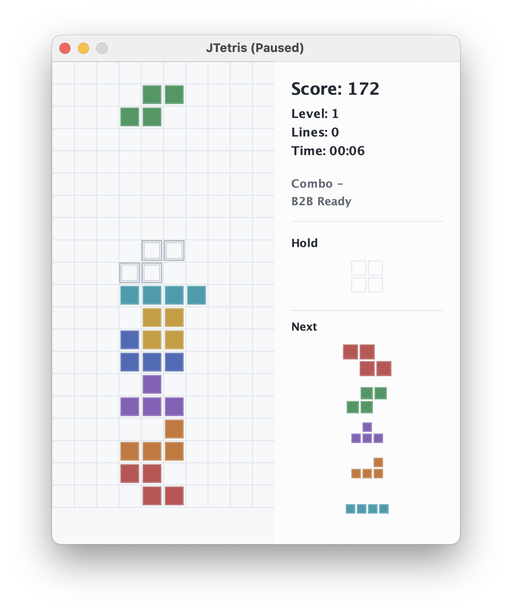
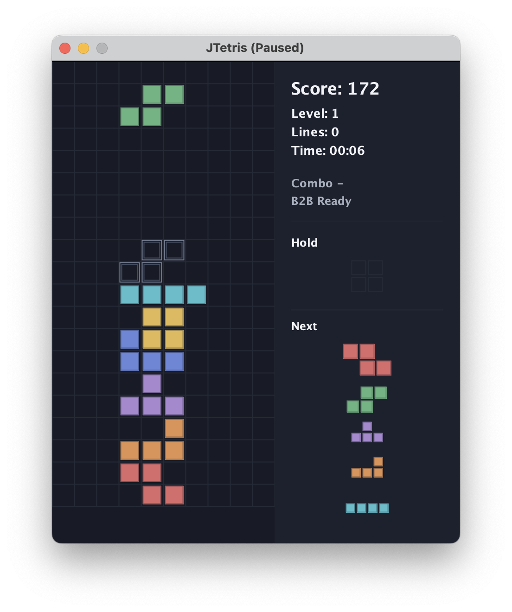

# JTetris (Java Swing)

A lightweight JTetris clone for learning Java, Swing UI, and basic game loop/scoring mechanics. UI text is English-only.

## Features
- Java 17 Swing desktop UI with light/dark theme support.
- Guideline-style Tetris mechanics including 7-bag randomization, hold piece, ghost piece, SRS rotation kicks, lock delay, combo/B2B scoring, and T-spin detection.
- Local best-score storage per user.
- Replay-oriented model hooks and regression tests for core gameplay behavior.
- Runnable jar packaging and macOS app-image packaging.

## Screenshots
| Light theme | Dark theme |
| --- | --- |
|  |  |

## Requirements
- JDK 17 or newer
- Maven is optional if you use the included Maven Wrapper

## Quick start
```bash
./mvnw clean package
java -jar target/jtetris-1.0.0-standalone.jar
```

## Project map
- Core code: `src/main/java/net/vetcafe/jtetris` (model, UI, scoring)
- Tests: `src/test/java/net/vetcafe/jtetris`
- Base package: `net.vetcafe.jtetris.*`
- Build: `pom.xml` (Java 17)
- Docs: `doc/overview.md`, `doc/algorithms.md`

## Development
```bash
./mvnw clean test
```

## Packaging
Build the standalone runnable jar:
```bash
./mvnw clean package
java -jar target/jtetris-1.0.0-standalone.jar
```

Build a macOS application image:
```bash
./mvnw -Pmac clean package
open target/dist/JTetris.app
```

App icon assets live under `art/`:
- `art/icon.svg`: deterministic source icon.
- `art/icon.icns`: macOS packaging icon.
- `art/icon.ico`: Windows packaging icon.
- `art/icons/icon-*.png`: Linux/desktop packaging sizes.

macOS app metadata is overridden from `packaging/macos/Info.plist` so the generated app bundle only advertises capabilities JTetris actually uses.

## UI theme and fonts
- JTetris now ships with a dual palette (light/dark) and chooses a default theme from system/LAF appearance.
- You can override theme selection with a JVM flag:
  - `-Djtetris.theme=auto` (default)
  - `-Djtetris.theme=light`
  - `-Djtetris.theme=dark`
- The UI uses Java/Swing logical fonts through `UiFonts`, with hooks left in place for future bundled fonts.

## Docs
- [Agent Instructions](AGENTS.md)
- [OpenSpec Project Guide](openspec/project.md)
- [OpenSpec Agent Guide](openspec/AGENTS.md)
- [Overview](doc/overview.md)
- [Algorithms](doc/algorithms.md)
- [Quality Gates](doc/quality-gates.md)
- [Historical Spec Workflow](doc/specs/README.md)
- [Historical Optimization Roadmap](doc/specs/roadmap.md)
- [Contributing](CONTRIBUTING.md)
- [License](LICENSE)
- [Notices](NOTICE.md)
- [Security](SECURITY.md)
- [Code of Conduct](CODE_OF_CONDUCT.md)

## Third-party notices
Runtime and test dependency notices are tracked in [NOTICE.md](NOTICE.md).

## Agent workflow
- New non-trivial work starts in `openspec/changes/<change-id>/`.
- Read `AGENTS.md`, `openspec/project.md`, and `openspec/AGENTS.md` before editing.
- Historical specs under `doc/specs` remain useful context, but new feature specs should use OpenSpec.
- Validate with `./mvnw clean test` before finishing.

## Controls
- Move: ← / →
- Soft drop: ↓
- Rotate: ↑ or Z
- Hard drop: Space
- Pause/Resume: P
- Restart: R
- Leaderboard: L (or menu)
- Quit: Esc (or menu)

## Scores
Local best-per-user scores are stored in `~/.tetris_scores.properties`. On game over you can save a score to an existing or new username; only the best score per user is kept.
