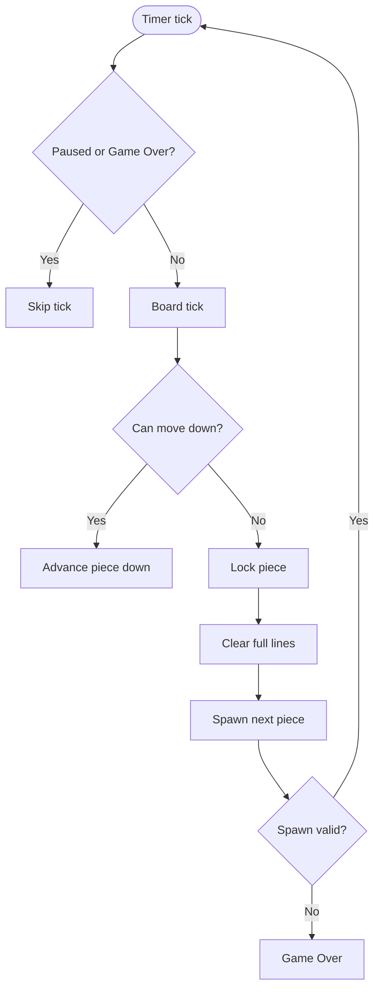

# Algorithms & Mechanics

## Board representation
- Grid: `TetrominoType[HEIGHT][WIDTH]`, with HEIGHT=22 (top 2 rows hidden for spawn).
- Active piece: `Tetromino current`; Next: `Tetromino next`.

## Movement & rotation
- Movement uses `Board.move(dx, dy)`; validates against bounds and occupied cells.
- Rotation via `Board.rotateCW/CCW()`; uses `TetrominoType.cells(rotation)` with 4 precomputed rotations.
- No wall kicks; simple validity check. Hidden rows allow most rotations without kicks.

## Gravity & locking
- `tick()` tries to move current down; if blocked, locks piece, clears lines, then spawns next.
- `hardDrop()` repeatedly moves down until blocked, then locks.

## Line clearing
- Scan from bottom up; when a full row is found, shift all above rows down and insert empty row at top; recheck same y after shift.

## Scoring & levels
- Per lock, if lines cleared: add 100/300/500/800 * level for 1/2/3/4 lines.
- `linesCleared` accumulates; `level = 1 + linesCleared / 10`.
- Current timer delay is fixed in code (700 ms); future work: derive delay from level.

## Game over
- Triggered if spawn position is invalid or a lock writes outside bounds.
- On game over: prompt to record score (optional) and ask to start new game.

## Persistence
- `ScoreManager` stores best-per-user in `~/.tetris_scores.properties`.
- Keys are lowercase usernames; original casing is remembered for display.
- Reads are tolerant of corrupt files (ignored).

## Rendering
- `GamePanel`: renders grid, locked blocks, and active piece; antialiased; modern dark palette.
- `SidePanel`: stats + next preview + controls list.

## Input
- Swing key bindings on root pane (`WHEN_IN_FOCUSED_WINDOW`): move, rotate (CW/CCW), drop, pause, restart, leaderboard, quit.
- Window focus listener nudges focus back to game panel.

## Mechanics flow

## Known simplifications
- No bag randomizer; uses `Random.nextInt` per piece.
- No wall kicks; SRS could be added.
- Lock delay and DAS/ARR not modeled; movement is immediate per key event.
- Timer speed does not yet scale with level.

## Extension ideas
- Add 7-bag randomizer.
- Implement basic wall kicks.
- Level-based fall speed.
- Ghost piece and hold piece.
- Sound effects.
- UI scaling for high-DPI and resizable layout.
