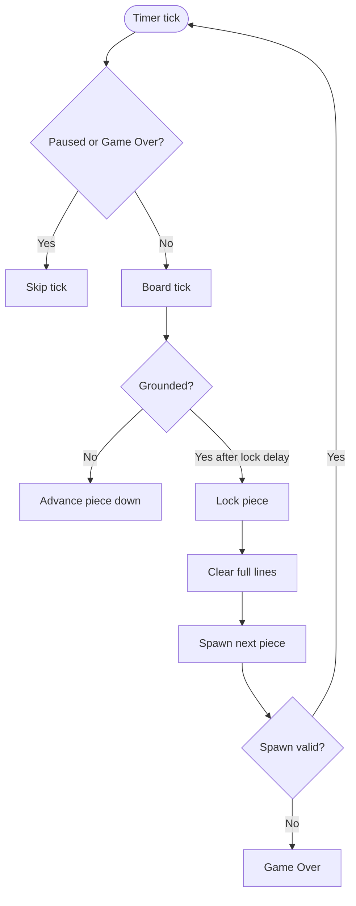

# Algorithms & Mechanics

## Board representation
- Grid: `TetrominoType[HEIGHT][WIDTH]`, with HEIGHT=22 (top 2 rows hidden for spawn).
- Active piece: `Tetromino current`; upcoming pieces: an ordered five-entry `ArrayDeque<TetrominoType>`.
- Piece generation uses `PieceBag` (7-bag randomizer) to keep distribution fair.

## Next queue
- `Board` owns exactly five upcoming tetromino types and exposes them as an immutable snapshot through `getNextQueue()`.
- Normal spawn removes the queue head, makes it active at spawn orientation, and appends one new type from `PieceBag`.
- `getNext()` remains a compatibility accessor for the queue head; new consumers should use `getNextQueue()` when complete preview state matters.
- Seeded replay verification compares the complete queue so future-piece state is reproducible.

## Movement & rotation
- Movement uses `Board.move(dx, dy)`; validates against bounds and occupied cells.
- Rotation via `Board.rotateCW/CCW()`; uses `TetrominoType.cells(rotation)` with 4 precomputed rotations.
- Rotation uses SRS kick retries (separate I-piece table and JLSTZ table).
- Rotation succeeds on the first valid kick candidate; fails when all candidates are invalid.

## Gravity & locking
- `tick()` tries to move current down; if blocked, enters the model-level lock-delay countdown used by replay and headless tests.
- The Swing Marathon loop uses `MarathonTiming.gravityDelayMs(level)` for level-based natural gravity and `MarathonTiming.lockDelayMs()` for a fixed UI-layer lock window before calling `Board.lockIfGrounded()`.
- `hardDrop()` repeatedly moves down until blocked, awards drop score, then locks.
- Successful move/rotation resets lock-delay countdown.

## Hold piece
- `Board.hold()` supports one hold per active piece lifecycle.
- First hold stores current, promotes the upcoming queue head, and refills the queue; subsequent hold swaps with the stored piece without changing the queue.
- Hold is reset only after lock/spawn, preserving the per-turn hold guard.

## T-Spin detection (baseline)
- `Board` computes T-Spin on lock using `TSpinDetector` and stores result in `wasLastLockTSpin()`.
- Baseline predicate: piece type is `T`, last successful action was rotation, and at least 3 pivot corners are occupied by wall/stack.
- This step only records detection state; scoring rules are unchanged.

## Ghost piece
- `Board.getGhost()` computes a non-mutating projection by copying current and descending until the next step collides.
- Ghost is render-only: it never changes board state and is hidden when game is over.
- Hard-drop lock destination is equivalent to ghost landing position.

## Line clearing
- Scan from bottom up; when a full row is found, shift all above rows down and insert empty row at top; recheck same y after shift.

## Scoring & levels
- Base line-clear score (non-T-Spin): 100/300/500/800 * level for 1/2/3/4 lines.
- Base T-Spin line-clear score: 800/1200/1600 * level for 1/2/3 lines.
- Combo bonus: consecutive clears add `50 * comboStreak * level` from streak 1 onward.
- Back-to-back (B2B): consecutive difficult clears (Tetris or T-Spin clear) apply 1.5x base score.
- Soft drop: 1 point per manually moved cell.
- Hard drop: 2 points per manually moved cell.
- `linesCleared` accumulates; `level = 1 + linesCleared / 10`.
- Marathon gravity delay starts at 700 ms and shortens by level to a 50 ms high-level floor.

## Game over
- Triggered if spawn position is invalid or a lock writes outside bounds.
- On game over: prompt to record score (optional) and ask to start new game.

## Persistence
- `ScoreManager` stores best-per-user in `net.vetcafe.jtetris/scores.properties` under the host platform's persistent application data directory:
  - macOS: `~/Library/Application Support`
  - Linux: `${XDG_DATA_HOME:-~/.local/share}`
  - Windows: `%LOCALAPPDATA%` with `~/AppData/Local` as fallback
- If no platform store exists, `~/.tetris_scores.properties` is loaded, written to the new store, and deleted only after the new write succeeds.
- If both files exist, the platform store is authoritative and the legacy file is not merged.
- Score keys are lowercase usernames. Original casing is remembered for display during the current process; reloaded properties use the normalized key as the display name.
- `__jtetris.lastScoreUser` stores the most recent score-entry user so the next game-over prompt can default to that player; it is ignored by leaderboard and user-list reads.
- Reads are tolerant of unreadable files. An unreadable legacy file is retained to avoid destructive migration.
- Deleting a leaderboard player removes that user's best score only after confirmation; failed persistence restores the in-memory record.

## Rendering
- `GamePanel`: renders grid, locked blocks, ghost projection, and active piece; antialiased; modern dark palette.
- `SidePanel`: structured hierarchy with core stats, player-facing scoring feedback, combo/B2B status, Hold, and five vertically ordered Next previews.
- `HelpContent`: authoritative Swing-native controls reference plus Hold/Next/Ghost concepts and advanced scoring terms.

## Input
- Swing key bindings on root pane (`WHEN_IN_FOCUSED_WINDOW`): move, rotate (CW/CCW), hard drop, hold (`C`), pause, restart, leaderboard, help, quit.
- `GameplayInputController` is the shared production boundary for core game operations. Swing delegates eligible actions to it, while headless tests drive the same methods against a seeded `Board` and fake monotonic clock.
- Horizontal input (`←` / `→`) uses a deterministic DAS/ARR repeater (`InputRepeater`) instead of OS key-repeat cadence. A press moves immediately, the default 180ms DAS separates observed taps from deliberate holds, and held movement then repeats every 35ms. The latest genuinely pressed direction wins when both are held.
- Soft drop (`↓`) uses a deterministic repeat policy (`SoftDropRepeater`) with immediate first step and fixed repeat interval.
- Repeat timing uses monotonic elapsed time. Each input poll emits at most one step and rebases its deadline after UI delays instead of replaying stale missed intervals.
- Modal UI states (score dialogs/leaderboard/new-game prompt) block gameplay input via a guard and clear held repeaters on enter/exit.
- Window focus listener nudges focus back to game panel.

## Input diagnostics
- All input diagnostics use the functional logger category `net.vetcafe.jtetris.input`.
- `DEBUG` events cross the Swing action and controller boundaries with monotonic timestamps, gameplay eligibility, hold duration, emitted steps, movement result, and before/after coordinates.
- `TRACE` events expose DAS/ARR and soft-drop repeater decisions, held state, active direction, deadlines, press order, emitted steps, and decision reasons.
- Input events are queued through an asynchronous file appender to minimize timing perturbation during diagnosis.
- The debug-only EDT watchdog logs a rate-limited `WARN` with observed delay and EDT stack when the event thread misses its response threshold.

## Mechanics flow

## Known simplifications
- Input repeat timing is deterministic for horizontal movement and soft drop.
- T-Spin Mini and Perfect Clear scoring are not yet implemented.

## Regression gates
- `BoardRegressionGateTest` enforces core model invariants: boundary/occupied-cell collisions, blocked rotation failure, line-clear state consistency, and blocked-spawn top-out.
- `GameplayInputControllerTest` verifies real board transitions for taps, held input timing, delayed polling, dual-direction priority, soft drop, rotation, hard drop, hold, and mixed seeded scenarios without creating a native window.
- Existing focused tests (`SrsRotationTest`, `LockDelayTest`, `ScoringRulesTest`, etc.) remain the baseline safety net for mechanics evolution.

## Seeded replay hooks
- `ReplayAction` defines deterministic model-level action tokens (`LEFT`, `RIGHT`, `SOFT_DROP`, `ROTATE_*`, `HARD_DROP`, `HOLD`, `TICK`).
- `Board.applyReplayAction(...)` executes and records actions into an ordered replay stream.
- `Board.replayFromSeed(seed, actions)` rebuilds board state from the same seed and action stream for reproducible debugging.

## Replay persistence format (`M7.3`)
- `ReplayPersistence.save(path, seed, actions)` writes UTF-8 text with three lines:
  - `JTETRIS_REPLAY_V1`
  - `seed=<long>`
  - `actions=<comma-separated ReplayAction names>`
- `ReplayPersistence.load(path)` validates each required line and fails fast on malformed payloads.
- Loaded payload (`LoadedReplay`) can be passed directly into `Board.replayFromSeed(...)` for deterministic reconstruction.
- UI export/import wiring is intentionally deferred; when added, UI should only call this model utility and keep action execution semantics in `Board`.

## Extension ideas
- Perfect Clear detection and scoring feedback.
- T-Spin Mini distinction.
- Sound effects.
- UI scaling for high-DPI and resizable layout.
