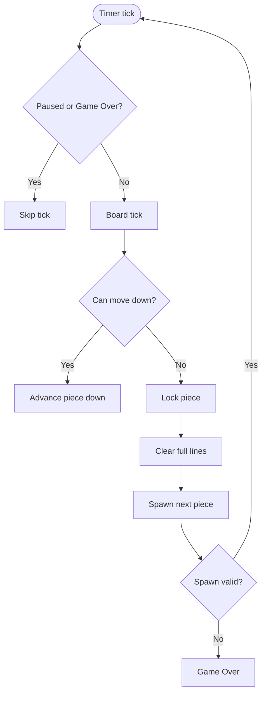

# 算法与机制（简体中文）

## 棋盘表示
- 网格：`TetrominoType[HEIGHT][WIDTH]`，HEIGHT=22（顶部 2 行隐藏用于生成）。
- 活动块：`Tetromino current`；下一块：`Tetromino next`。

## 移动与旋转
- `Board.move(dx, dy)` 执行平移，先检查边界与占用。
- `Board.rotateCW/CCW()` 使用 `TetrominoType.cells(rotation)` 的 4 个预计算形态。
- 无墙踢；隐藏行通常足够旋转空间。

## 重力与落锁
- `tick()` 下落一步；若受阻则落锁，消行，生成下一块。
- `hardDrop()` 一直下落到受阻后落锁。

## 消行
- 自底向上扫描；若某行全满，将其上方全部下移一行，并在顶部插入空行；同一行重检。

## 计分与等级
- 每次落锁若有消行：1/2/3/4 行分别 +100/300/500/800 * 等级。
- `linesCleared` 推导等级：`level = 1 + linesCleared / 10`。
- 当前定时固定 700 ms；未来可按等级缩短。

## 游戏结束
- 生成点非法或写出边界即结束。
- 结束时可选择记分并询问是否再开一局。

## 持久化
- `ScoreManager` 将每用户最高分存于 `~/.tetris_scores.properties`。
- 用户名存小写，显示记原始大小写；损坏文件忽略。

## 渲染
- `GamePanel`：绘制网格、锁定块与活动块；抗锯齿；深色现代配色。
- `SidePanel`：统计 + 下一块预览 + 控制提示。

## 输入
- 根窗格绑定键（`WHEN_IN_FOCUSED_WINDOW`）：移动、旋转（顺/逆时针）、下落、暂停、重开、排行榜、退出。
- 窗口焦点监听器帮助恢复焦点到游戏面板。

## 机制流程

## 已知简化
- 无 7-bag 随机；使用 `Random.nextInt`。
- 无墙踢；可按 SRS 扩展。
- 无锁延迟、DAS/ARR；移动即时。
- 定时未随等级变速。

## 扩展想法
- 7-bag 随机器。
- 基础墙踢。
- 按等级调整下落速度。
- 幽灵影子块与暂存块。
- 音效支持。
- 高 DPI 与可缩放 UI。

