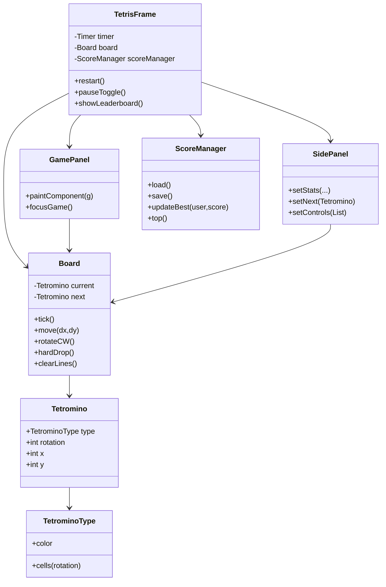

# JTetris Project Overview

## Purpose
A concise Swing-based JTetris for learning Java, Swing UI, and basic game loop/algorithm patterns.

## Architecture
- **Model**: `net.vetcafe.jtetris.model.*`
  - `Board`: game state (grid, active piece, hold/next piece, ghost projection, scoring, level). Handles gravity (`tick`), movement, rotation, line clearing, spawning, baseline T-Spin lock-state tracking, and seeded replay hooks. Hidden top rows keep spawn safe.
  - `Tetromino` & `TetrominoType`: piece data and rotations.
- **UI**: `net.vetcafe.jtetris.ui.*`
  - `TetrisFrame`: main window, timer-driven loop, key bindings, menu, pause/restart/leaderboard, score prompt on game over.
  - `InputRepeater`: deterministic horizontal DAS/ARR state machine used by `TetrisFrame`.
  - `SoftDropRepeater`: deterministic soft-drop repeat timing used by `TetrisFrame`.
  - `GamePanel`: renders board, ghost projection, and active piece; focuses itself on show; modern dark palette.
  - `SidePanel`: stats, next preview, controls cheat-sheet.
- **Scores**: `net.vetcafe.jtetris.score.ScoreManager`: per-user local high scores stored in `~/.tetris_scores.properties` (best-only per user).

## Architecture at a glance

## Game Loop & Timing
- Swing `Timer` in `TetrisFrame` ticks every ~700 ms (speeds up by level). On each tick: if not paused and not game over, call `Board.tick()` (gravity); repaint board.
- A second short-interval timer polls held horizontal and soft-drop input via repeaters; movement/rotation/drop actions apply to model and rendering pulls from model snapshot.
- Modal dialogs (score entry/leaderboard/new game prompt) temporarily block gameplay input and clear held repeaters to prevent post-dialog drift.

## Scoring & Levels
- Line clear scores (per classic Tetris style): 1/2/3/4 lines = 100/300/500/800 * level.
- Consecutive clears add combo bonus; difficult clear chains (Tetris/T-Spin clears) use back-to-back bonus.
- `linesCleared` total drives `level = 1 + linesCleared / 10` (speeds fall via timer delay tuning in future).
- High score: best-per-user persists locally. On game over, prompt to pick existing or add new user; store if higher.

## Controls (UI is English-only)
- Move: ← / →
- Soft drop: ↓
- Rotate: ↑ or Z
- Hard drop: Space
- Pause/Resume: P
- Restart: R
- Leaderboard: L (also via menu)
- Quit: Esc (also via menu)

## UI Layout & Styling
- `GamePanel` center; `SidePanel` on the right with Stats (Score/Level/Lines), score breakdown (Event/Combo/B2B), Next piece, Controls list.
- Ghost piece uses a translucent version of active-piece color to indicate hard-drop landing.
- Modern colors: deep charcoal background with teal/amber/lavender/mint/red/indigo/coral pieces.

## Data & Persistence
- Scores stored at `~/.tetris_scores.properties`. Keys are lowercase usernames; values are best scores. File is best-effort read/write; corrupt file is ignored and treated as empty.

## Notes for learners
- Input is handled via key bindings on the root pane (not raw key listeners).
- Gravity, locking, and line clearing live entirely in `Board`; UI remains thin.
- Hidden top rows (HEIGHT 22 with 2 hidden) keep spawn safe.
