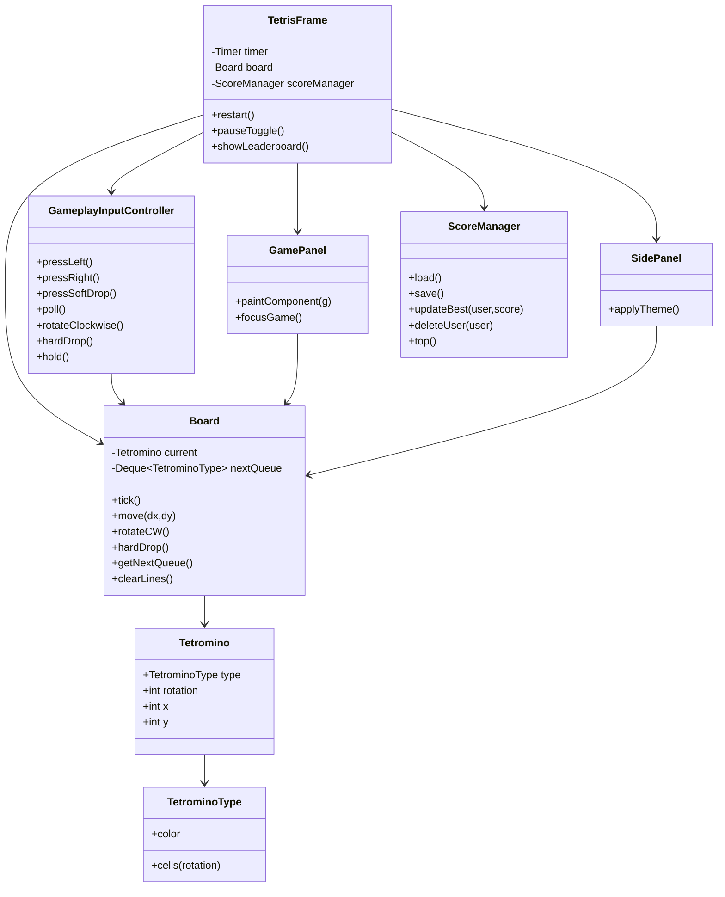

# JTetris Project Overview

## Purpose
A concise Swing-based JTetris for learning Java, Swing UI, and basic game loop/algorithm patterns.

## Architecture
- **Model**: `net.vetcafe.jtetris.model.*`
  - `Board`: game state (grid, active piece, hold piece, three-piece upcoming queue, ghost projection, scoring, level). Handles gravity (`tick`), movement, rotation, line clearing, spawning, baseline T-Spin lock-state tracking, and seeded replay hooks. Hidden top rows keep spawn safe.
  - `Tetromino` & `TetrominoType`: piece data and rotations.
- **UI**: `net.vetcafe.jtetris.ui.*`
  - `TetrisFrame`: main window, timer-driven loop, key bindings, menu, pause/restart/leaderboard, and in-stage prompt overlays for game-over, score entry, leaderboard, and exit confirmation.
  - `GameplayInputController`: window-independent production input orchestration shared by `TetrisFrame` and headless integration tests.
  - `InputRepeater`: deterministic horizontal DAS/ARR state machine owned by `GameplayInputController`.
  - `SoftDropRepeater`: deterministic soft-drop repeat timing owned by `GameplayInputController`.
  - `GamePanel`: renders board, ghost projection, and active piece; focuses itself on show; modern dark palette.
  - `SidePanel`: performance stats, scoring feedback, combo/B2B status, Hold preview, and three-piece Next queue.
  - `HelpContent`: Swing-native help overlay content for controls and modern Tetris concepts surfaced by the UI.
- **Scores**: `net.vetcafe.jtetris.score.ScoreManager`: best-only per-user local high scores stored in a package-namespaced platform application data directory.

## Architecture at a glance

## Game Loop & Timing
- Swing `Timer` in `TetrisFrame` ticks every ~700 ms (speeds up by level). On each tick: if not paused and not game over, call `Board.tick()` (gravity); repaint board.
- A second short-interval timer asks `GameplayInputController` to poll held horizontal and soft-drop input using monotonic elapsed time. Each poll emits at most one step per held input, so delayed Swing callbacks discard stale repeat intervals instead of causing movement bursts.
- Core gameplay operations can be executed headlessly against a seeded real `Board` with a fake clock; Swing remains responsible for eligibility, repainting, overlays, focus, and session timing.
- In-stage overlays (score entry/leaderboard/new game prompt/exit confirmation) temporarily block gameplay input and clear held repeaters to prevent post-overlay drift.

## Scoring & Levels
- Line clear scores (per classic Tetris style): 1/2/3/4 lines = 100/300/500/800 * level.
- Consecutive clears add combo bonus; difficult clear chains (Tetris/T-Spin clears) use back-to-back bonus.
- `linesCleared` total drives `level = 1 + linesCleared / 10` (speeds fall via timer delay tuning in future).
- High score: best-per-user persists locally. On game over, prompt to pick existing or add new user; store if higher. The leaderboard supports single-player deletion after explicit confirmation.

## Controls (UI is English-only)
- Move: ← / →
- Soft drop: ↓
- Rotate: ↑ or Z
- Hard drop: Space
- Pause/Resume: P
- Restart: R
- Leaderboard: L (also via menu)
- Help: H (also via menu)
- Quit: Esc (also via menu)
- Theme: choose `Theme -> Auto/Light/Dark` from the menu bar (applies immediately)

## UI Layout & Styling
- `GamePanel` is centered; `SidePanel` uses a clear information hierarchy with prominent Score, compact Level/Lines/Time, scoring feedback, Combo/B2B status, a separate Hold section, and three vertically ordered Next previews.
- The permanent controls cheat-sheet was removed from the side panel; controls remain available in Help through `H` or the menu.
- The current mode is Endless Marathon: play continues until top-out, and Time tracks active gameplay rather than wall-clock time.
- Every blocking in-window overlay pauses gravity and session time; closing the final overlay resumes only when the game is not manually paused or over.
- Help is implemented as a scrollable in-window Swing overlay.
- UI theme supports startup override (`-Djtetris.theme=auto|light|dark`) and runtime switching via menu without restart.
- Ghost piece uses a subtle, unified neutral shadow color (instead of piece-matched colors) to indicate hard-drop landing.
- When a line clear happens, the cleared row area briefly flashes in a simple LCD-style overlay.
- Flash tuning supports JVM properties: `-Djtetris.flash.duration.ms=180`, `-Djtetris.flash.step.ms=45`, `-Djtetris.flash.dark.fill.alpha=132`, `-Djtetris.flash.light.fill.alpha=154`, `-Djtetris.flash.dark.edge.alpha=178`, `-Djtetris.flash.light.edge.alpha=196`.
- Modern colors: deep charcoal background with teal/amber/lavender/mint/red/indigo/coral pieces.

## Data & Persistence
- Scores use platform application data directories:
  - macOS: `~/Library/Application Support/net.vetcafe.jtetris/scores.properties`
  - Linux: `${XDG_DATA_HOME:-~/.local/share}/net.vetcafe.jtetris/scores.properties`
  - Windows: `%LOCALAPPDATA%\net.vetcafe.jtetris\scores.properties` (falling back to `~/AppData/Local/...`)
- The legacy `~/.tetris_scores.properties` file is migrated when no new store exists, then deleted only after the new store is written successfully.
- Keys remain lowercase usernames and values remain best scores. New-store read failures are treated as empty; an unreadable legacy file is preserved instead of being replaced.
- Replay persistence is model-layer only in `M7.3` via `ReplayPersistence`:
  - File header: `JTETRIS_REPLAY_V1`
  - Seed line: `seed=<long>`
  - Action line: `actions=<comma-separated ReplayAction names>`
- Loaded replay payloads can be reconstructed deterministically with `Board.replayFromSeed(...)`.
- Menu-level replay export/import UX is planned for a later UI-focused step.

## Notes for learners
- Input is handled via key bindings on the root pane (not raw key listeners).
- Gravity, locking, and line clearing live entirely in `Board`; UI remains thin.
- Hidden top rows (HEIGHT 22 with 2 hidden) keep spawn safe.
