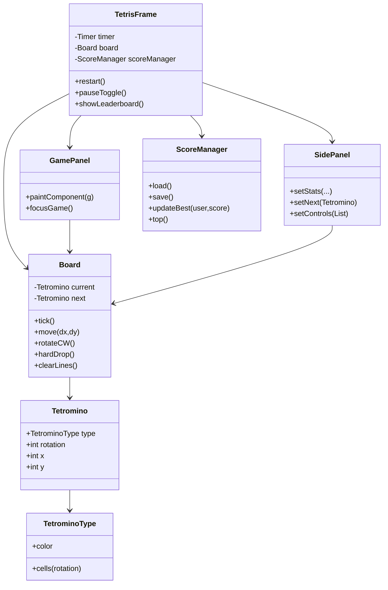

# Tetris 项目概览（简体中文）

本项目提供一个基于 Java Swing 的精简 Tetris，实现用于学习 Java、Swing UI 和基础游戏循环/计分模式。游戏 UI 与代码保持英文；本文档为中文说明。

## 目的
- 学习 Swing 事件循环、定时器驱动游戏逻辑。
- 理解方块旋转、下落、消行与得分机制。
- 练习简单的本地持久化（用户最高分）。

## 架构
- **模型层**：`tetris.model.*`
  - `Board`：网格状态、当前/下一块、重力下落、移动/旋转、消行、生成新块，含隐藏顶行以避免开局撞顶。
  - `Tetromino` & `TetrominoType`：方块定义与旋转形态。
- **UI 层**：`tetris.ui.*`
  - `TetrisFrame`：主窗口、Swing Timer 驱动循环、按键绑定、菜单、暂停/重开/排行榜、游戏结束时分数提示。
  - `GamePanel`：绘制网格与当前方块，自主请求焦点，现代深色配色。
  - `SidePanel`：统计信息、下一块预览、控制键提示。
- **计分**：`tetris.score.ScoreManager`：本地每用户最高分存于 `~/.tetris_scores.properties`。

## 架构关系图

## 游戏循环与定时
- `TetrisFrame` 内的 Swing `Timer` 每约 700 ms 触发一次；若未暂停且非结束，调用 `Board.tick()` 下落；然后重绘。
- 移动/旋转/下落通过按键绑定，作用于模型；渲染从模型读取。

## 计分与等级
- 消行得分（经典风格）：1/2/3/4 行 = 100/300/500/800 * 等级。
- `linesCleared` 推导等级：`level = 1 + linesCleared / 10`。
- 游戏结束可选择记录到某用户，仅保留该用户历史最高分。

## 控制键（界面为英文）
- 左右：← / →
- 软降：↓
- 旋转：↑ 或 Z
- 直落：Space
- 暂停/继续：P
- 重开：R
- 排行榜：L（或菜单）
- 退出：Esc（或菜单）

## UI 布局与配色
- 中间 `GamePanel`，右侧 `SidePanel`（统计、下一块、控制说明）。
- 现代深色底，方块使用青/琥珀/薰衣草/薄荷/红/靛蓝/珊瑚等色。

## 数据与持久化
- 本地分数文件 `~/.tetris_scores.properties`，键为小写用户名，值为最高分；读写尽力而为，损坏文件被忽略。

## 学习提示
- 输入使用按键绑定（`WHEN_IN_FOCUSED_WINDOW`），避免原始 KeyListener。
- 重力、落锁、消行逻辑在 `Board`，UI 保持薄。
- 顶部隐藏行保证生成安全。

